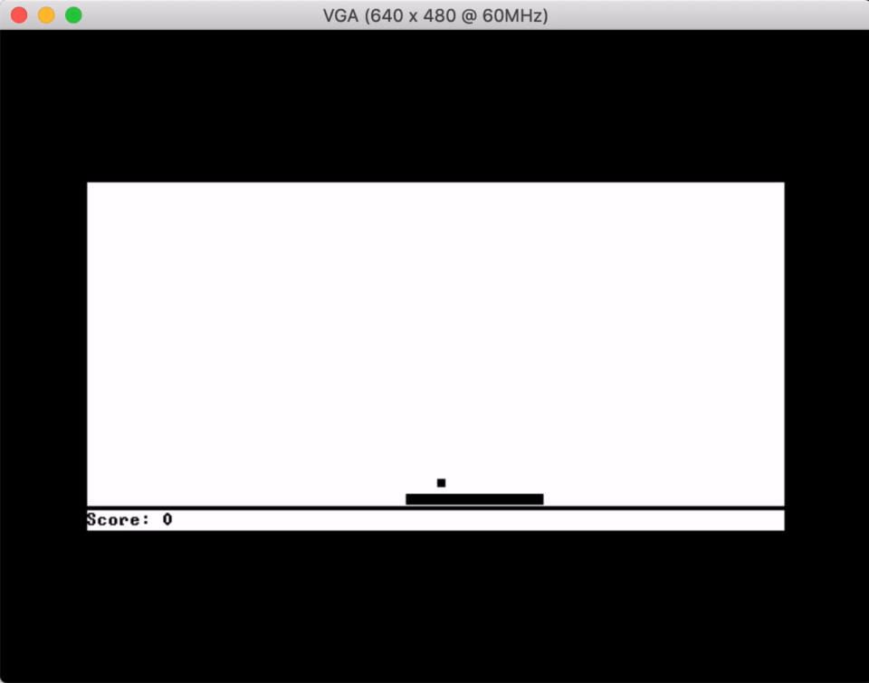

# iCE2Tetris
This project is an FPGA implementation of the [Nand to Tetris](https://www.nand2tetris.org/) course as set out in the book [The Elements of Computing Systems](https://mitpress.mit.edu/books/elements-computing-systems). The project targets the [iCE40 UltraPlus](https://www.latticesemi.com/en/Products/FPGAandCPLD/iCE40UltraPlus) FPGA chip and specifically the [iCEBreaker FPGA board](https://www.crowdsupply.com/1bitsquared/icebreaker-fpga).

When connected to a screen and keyboard using the [VGA](https://store.digilentinc.com/pmod-vga-video-graphics-array/) and [PS/2](https://store.digilentinc.com/pmod-ps2-keyboard-mouse-connector/) Pmods, this system is capable of running any valid Hack program, achieving full compatibility with the Java-based software emulator provided with the course materials. The program ROM can be uploaded as a binary file to the iCEBreaker board’s onboard flash chip and will be read into memory at boot time.

This system is entirely built on open source software and uses the [Open Tool Forge FPGA toolchain](https://github.com/open-tool-forge/fpga-toolchain), particularly [Yosys](https://github.com/YosysHQ/yosys) for Verilog synthesis, [Project IceStorm](https://github.com/YosysHQ/icestorm) for iCE40 support, and [nextpnr](https://github.com/YosysHQ/nextpnr) for place-and-route.

In addition, an interactive [Verilator](http://verilator.org) simulation of the design can be found in the `sim` directory. Based on the SDL2 multimedia library, the simulator captures the VGA signal and renders it on the screen; as well as providing an emulated SPI flash ROM chip and a PS/2 virtual keyboard.



## Usage
After installing the Open Tool Forge toolchain and plugging in your iCEBreaker board over USB, simply run:

```
$ make prog
```

This will synthesise the Verilog design, run place-and-route and timing analysis, then upload it to the FPGA board.

To execute a Hack program, it must be uploaded to the iCEBreaker board as a binary file containing 16-bit Hack instructions stored in big-endian byte order. To compile a Jack program into a `.bin` file, you can use [my Jackc compiler](https://github.com/leocassarani/jackc):

```
$ jackc --bin -o program.bin Main.jack
```

Or, if you already have a `.hack` file, you can convert it into binary with this handy Ruby one-liner:

```
$ ruby -ne 'print [$_.to_i(2)].pack("n")' < program.hack > program.bin
```

To upload the binary file, run:

```
$ make flash ROM=program.bin
```

This will copy the file to the on-board flash memory starting at offset 1,024KiB. Note that `.bin` files can be at most 64KiB as their 16-bit instructions are addressable by a 15-bit number (2^15 = 32Ki).

Next, plug in a VGA screen and a PS/2 keyboards into the Pmods, and connect the iCEBreaker to a USB port. The Hack program will start executing. To reset the execution to the start, press the button closest to the USB port.

## Simulator
To execute a Hack program on the simulated Verilog design, run:

```
$ make test ROM=program.bin
```

This will compile the Verilator-based simulator and execute it. Note that the Verilator binary and library files must be installed for this to work. The simulator has been tested with Verilator 4.034 or above and is not guaranteed to work with earlier versions.

When the simulator starts, the Verilog logic will send SPI “read” operations to the simulated flash chip, which will respond by streaming the contents of `program.bin`. Once the ROM has been fully read into memory, the VGA output signals will be converted into a 512x256 picture and displayed within the SDL window.

Whenever a key is pressed, if its key code is supported by the Hack platform, it will be translated into PS/2 signals and sent to the simulated keyboard client. Note that as the Hack platform only supports one key press at a time, only the more recent of multiple simultaneous key presses will be picked up by the simulated logic. Pressing either Ctrl+R or ⌘R will reset the simulator and restart execution.

## Acknowledgments
Thanks to everyone on the [1BitSquared Discord](https://1bitsquared.com/pages/chat) `#icebreaker` channel who volunteered to help whenever I got stuck. Particular thanks to [Ed Bordin](https://github.com/edbordin),  [Dave Shah](https://github.com/daveshah1), [Piotr Esden-Tempski](https://github.com/esden), and [Sylvain “tnt” Munaut](https://github.com/smunaut).

My [VRAM](https://github.com/leocassarani/ice2tetris/blob/master/rtl/vram.v) implementation was inspired by [smunaut/ice40-playground](https://github.com/smunaut/ice40-playground) and my [PS/2 driver](https://github.com/leocassarani/ice2tetris/blob/master/rtl/keyboard.v) was adapted from the [PS/2 mouse reference system on the Digilent website](https://reference.digilentinc.com/reference/pmod/pmodps2/start).

Finally, my [VGA](https://github.com/leocassarani/ice2tetris/blob/master/rtl/vga.v) implementation was largely possible thanks to [Ben Eater](https://eater.net)'s [video](https://www.youtube.com/watch?v=l7rce6IQDWs) [series](https://www.youtube.com/watch?v=uqY3FMuMuRo) on building a digital circuit to output a VGA signal.
